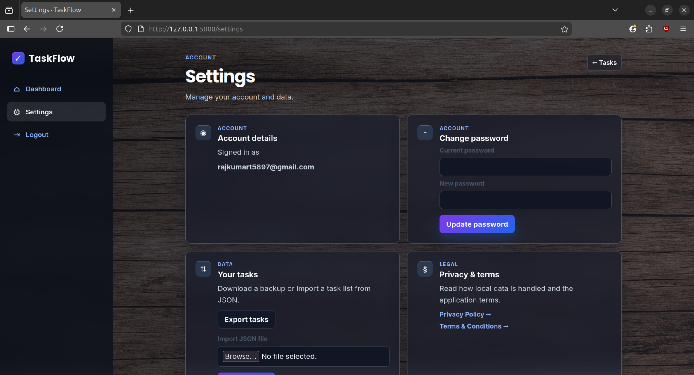

# Personal Task Tracker


A small, self-hosted, multi-user task tracker. Flask backend, SQLite storage, vanilla JavaScript frontend — no build step, no ORM, no frontend framework.

## Screenshots

<table>
  <tr>
    <td width="50%"></td>
    <td width="50%"></td>
  </tr>
  <tr>
    <td align="center"><sub>Login</sub></td>
    <td align="center"><sub>Dashboard</sub></td>
  </tr>
  <tr>
    <td width="50%"></td>
    <td width="50%"></td>
  </tr>
  <tr>
    <td align="center"><sub>New task</sub></td>
    <td align="center"><sub>Settings</sub></td>
  </tr>
</table>

## What this is (and isn't)

This is a **local, single-machine task manager**, built to practice full-stack fundamentals with real attention to backend security — not a hosted product. It's meant to run on your own machine or a trusted private server, for you and anyone else you register an account for.

It is **not** rate-limited against brute-force login attempts, **not** built for public internet exposure without additional hardening, and **not** using an ORM or migrations system — schema changes are handled by a simple one-time migration path in `init_db()`.

## Highlights

- Per-account task isolation — every query is scoped to the logged-in user's ID, verified at the database layer
- Passwords stored only as salted hashes (Werkzeug's `generate_password_hash`, PBKDF2 by default) — never logged, never persisted in plaintext
- CSRF tokens on every state-changing request, compared with `secrets.compare_digest` to avoid timing attacks
- Task content is escaped before it's injected into the DOM — no stored XSS via task titles/descriptions
- CSP, `X-Content-Type-Options`, and `Referrer-Policy` headers set on every response
- JSON import/export, validated through the same path as manual task creation — no "trusted" shortcut for imports

## Quick start

```bash
python3 -m pip install flask
python3 app.py
```

Open `http://127.0.0.1:5000`. A `database.db` file is created automatically on first run.

For sessions that survive a server restart, set a secret key first:

```bash
export TASK_MANAGER_SECRET_KEY="replace-with-a-long-random-value"
python3 app.py
```

## Features

- Create, edit, and delete tasks with a title and optional description
- Set status to `Todo`, `In Progress`, or `Done`
- Register, log in, log out — locally stored password hashes only
- Change password from Settings
- Export all tasks as `tasks.json`, import from a JSON file (capped at 1,000 tasks per import)

## API

| Method | Path | Purpose |
|---|---|---|
| `GET` | `/api/tasks` | List the logged-in user's tasks |
| `POST` | `/api/tasks` | Create a task |
| `PUT` | `/api/tasks/<id>` | Update one of the user's tasks |
| `DELETE` | `/api/tasks/<id>` | Delete one of the user's tasks |
| `GET` | `/api/tasks/export` | Download tasks as `tasks.json` |
| `POST` | `/api/tasks/import` | Import tasks from a JSON upload |

`title`, `description`, and (on update) a valid `status` are required in the request body. All state-changing requests need the CSRF token issued to the session — sent as `X-CSRF-Token` for API calls, or as a hidden form field for HTML forms.

## Project structure

```
.
├── app.py                 # Flask app, auth, CSRF, and the task API
├── database.db            # SQLite data, created at runtime
├── templates/              # Jinja templates (auth pages, dashboard, settings, legal)
└── static/
    ├── app.js              # Fetch calls + DOM rendering
    └── style.css
```

## Known limitations

- No login rate limiting — repeated password guesses against `/login` aren't throttled
- Minor timing difference between "no such account" and "wrong password" responses on login
- `SESSION_COOKIE_SECURE` isn't set — fine over local HTTP, would need adding before running behind HTTPS
- No automated test suite yet — verification is currently manual (see below)

## Manual verification checklist

Since there's no automated test suite: registration/login/logout, cross-account task isolation, full CRUD, invalid-status handling, password change, and import/export should all be re-checked by hand after backend changes.

## License

MIT
